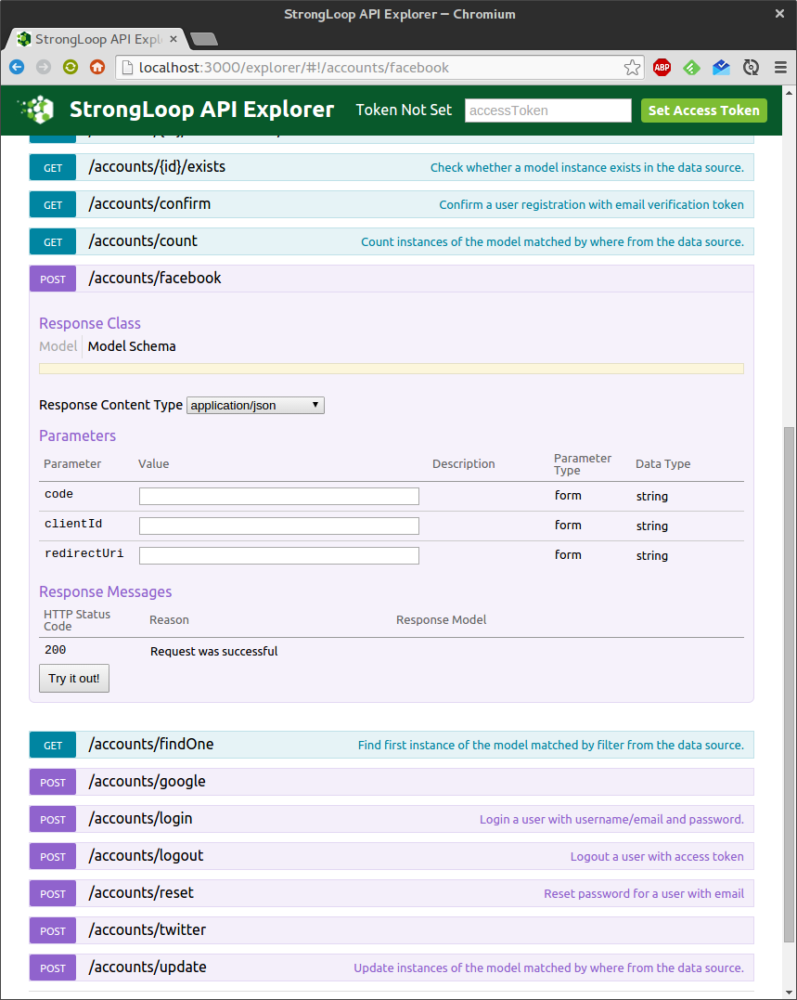

# loopback-satellizer

[](https://gitter.im/moooink/loopback-component-satellizer?utm_source=badge&utm_medium=badge&utm_campaign=pr-badge&utm_content=badge)

[](https://travis-ci.org/moooink/loopback-component-satellizer)

[](https://waffle.io/moooink/loopback-component-satellizer)

# How to use it



## Install the component

```bash
npm install --save loopback-component-satellizer
```

## Configuration for facebook

In your loopback component-config.json file, add your configuration like this

```javascript
"loopback-component-satellizer": {
  "facebook": {
    "model": "Account",
    "credentials": {
      "public": "this_is_a_client_id",
      "private": "this_is_a_private_key"
    },
    "version": "v2.3",
    "fields": ["email"],
    "uri": "/facebook",
    "mapping": {
      "id": "facebook",
      "email": "email",
      "first_name": "firstName",
      "last_name": "lastName",
      "gender": "gender"
    }
  }
}
```

Add the ACLs to allow (or not) the access to the API

```javascript
"acls": [
  {
    "accessType": "EXECUTE",
    "principalType": "ROLE",
    "principalId": "$everyone",
    "permission": "ALLOW",
    "property": "facebook"
  },
```

Then configure satellizer in the client and take care of the conflicts between the satellizer authorization token and the loopback authorization token.

## Configuration for Google+

In your loopback component-config.json file, load the component

```javascript
"loopback-component-satellizer": {
  "google": {
    "model": "Account",
    "credentials": {
      "public": "this_is_a_client_id",
      "private": "this_is_a_private_key"
    },
    "uri": "/google",
    "mapping": {
      "sub": "google",
      "email": "email",
      "given_name": "firstName",
      "family_name": "lastName",
      "gender": "gender"
    }
  }
}
```

Add the ACLs to allow (or not) the access to the API

```javascript
"acls": [
  {
    "accessType": "EXECUTE",
    "principalType": "ROLE",
    "principalId": "$everyone",
    "permission": "ALLOW",
    "property": "google"
  },
```

Then configure satellizer in the client and take care of the conflicts between the satellizer authorization token and the loopback authorization token.
